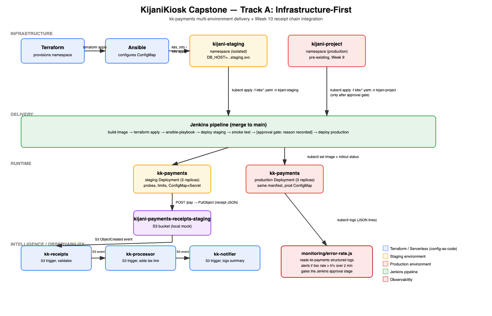

# KijaniKiosk Capstone — Track A: Infrastructure-First

## What is this?
An extension of the KijaniKiosk `kk-payments` service (built weeks 3–9)
into a two-environment, monitored delivery pipeline: a Terraform-provisioned
`kijani-staging` namespace, an Ansible-configured environment-specific
ConfigMap, a Jenkins pipeline that auto-deploys to staging and gates
production behind a passing smoke test and a recorded human approval, and
the Week 10 serverless receipt chain wired to fire for real when
`kk-payments` processes a payment. See `docs/scope.md` for the full problem
statement and success criteria.

## Architecture


| Component | Role |
|---|---|
| Terraform (`terraform/`) | Provisions the isolated `kijani-staging` namespace |
| Ansible (`ansible/`) | Renders and applies the staging `kk-payments` ConfigMap (different `DB_HOST`) |
| Jenkins (`Jenkinsfile`) | Builds the image, runs Terraform/Ansible, deploys to staging, smoke-tests, gates, deploys to production |
| `kk-payments` (`k8s/`) | Same Deployment manifest in both namespaces; `/pay` writes a receipt to S3 |
| Serverless chain (`serverless/`) | `kk-receipts` → `kk-processor` → `kk-notifier`, fired by the receipt S3 write |
| Monitoring (`monitoring/`) | Log-based kk-payments error-rate check, gates the approval stage |

## Prerequisites
- Docker Desktop
- [minikube](https://minikube.sigs.k8s.io/) >= 1.33, with the `docker` driver
- `kubectl` >= 1.28
- [Terraform](https://developer.hashicorp.com/terraform) >= 1.5
- [Ansible](https://docs.ansible.com/) >= 2.15, with the `kubernetes.core` collection (`ansible/requirements.yml`)
- Node.js >= 20 and npm (for `kk-payments`, the serverless handlers, and `scripts/`)
- Jenkins with the Docker, Kubernetes CLI, and Pipeline plugins, and `kubectl`/`terraform`/`ansible`/`node` on the agent PATH (for running the actual pipeline; not required to run the components manually)

## Setup
See `docs/runbook.md` — "Reproducing the system from a clean checkout" for
the exact command sequence, from `minikube start` through firing a receipt
through the chain.

## How to run the pipeline
1. Point Jenkins at this repository's `main` branch (Pipeline job, "Pipeline script from SCM").
2. Push/merge a commit to `main`.
3. Jenkins runs: build image → `terraform apply` (staging namespace) → `ansible-playbook` (staging ConfigMap) → deploy to `kijani-staging` → smoke test (`scripts/smoke-test.sh` + `monitoring/check-kk-payments-error-rate.sh`) → **pauses at an approval gate** requiring an `APPROVAL_REASON` — → deploy to `kijani-project` (production).
4. If the smoke test or error-rate check fails, the pipeline stops before the approval gate is ever offered — production is never touched.

## How to verify it works
```bash
kubectl get ns kijani-staging                       # success criterion 1
kubectl rollout status deployment/kk-payments -n kijani-staging
curl http://127.0.0.1:13001/health                  # via kubectl port-forward, see runbook
curl -X POST http://127.0.0.1:13001/pay -H 'Content-Type: application/json' \
  -d '{"items":[{"name":"Coffee","price":150,"quantity":2}]}'
# then check the run-local-chain.js terminal for kk-receipts / kk-processor /
# kk-notifier log lines carrying the same orderId — success criterion 3
cat monitoring/error-rate-summary.json               # gate the approval stage reads
```

## Known limitations
- **Local S3 mock, not real AWS.** The receipt chain runs against `/tmp/kijani-s3-local` + optionally `serverless-offline`, not a deployed AWS stack — see `docs/scope.md` "Out of Scope". Production use would need a real S3 bucket and IAM role per `serverless.yml`'s `resources` block.
- **Kubernetes-to-host filesystem seam is fragile on minikube's `docker` driver** — documented in detail, with the fix, in `docs/runbook.md` "The integration seam that breaks first." Not fixed automatically because the correct fix (`minikube mount`) is an operator step, not something the manifest can express.
- **No real staging database.** `DB_HOST` in the staging ConfigMap points at a Service name that nothing currently provisions — `kk-payments` doesn't make a real DB connection yet (Week 9 carry-forward), so there is no consumer to justify standing up Postgres for this increment.
- **Prometheus not used.** Option B (log-based error rate) is implemented instead of Option A, because no Prometheus instance exists in this environment — see `monitoring/README.md` for the equivalent rule expressed both ways.
- **Jenkins pipeline is not exercised by a real Jenkins instance in this repository's CI** — the `Jenkinsfile` is a real, syntactically valid pipeline definition matching the Week 5/7 house style, but running it end-to-end requires a Jenkins controller with Docker/kubectl/terraform/ansible on the agent, which is outside what this repo can provision for itself.

## Governance
`docs/ai-governance-log.md` documents AI tool use during this build in the
required eight-field format. `docs/governance-checklist.md` is the six-point
checklist entries are assessed against.
